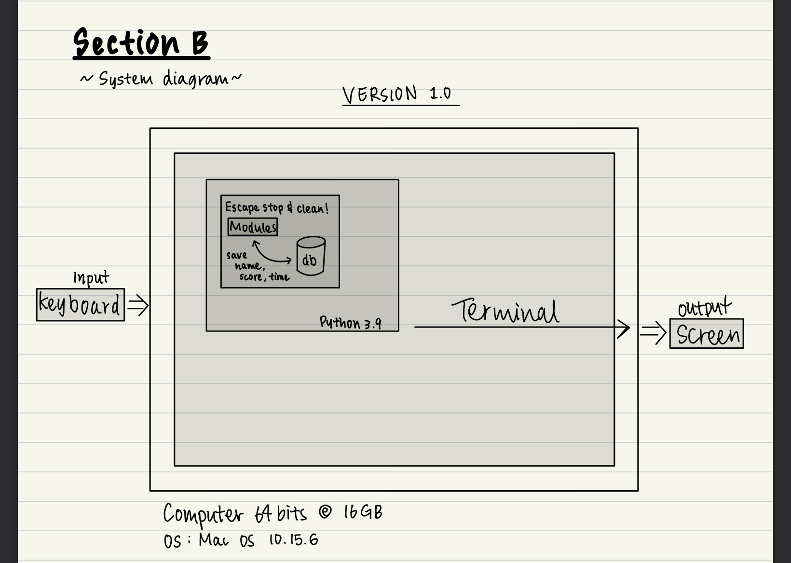
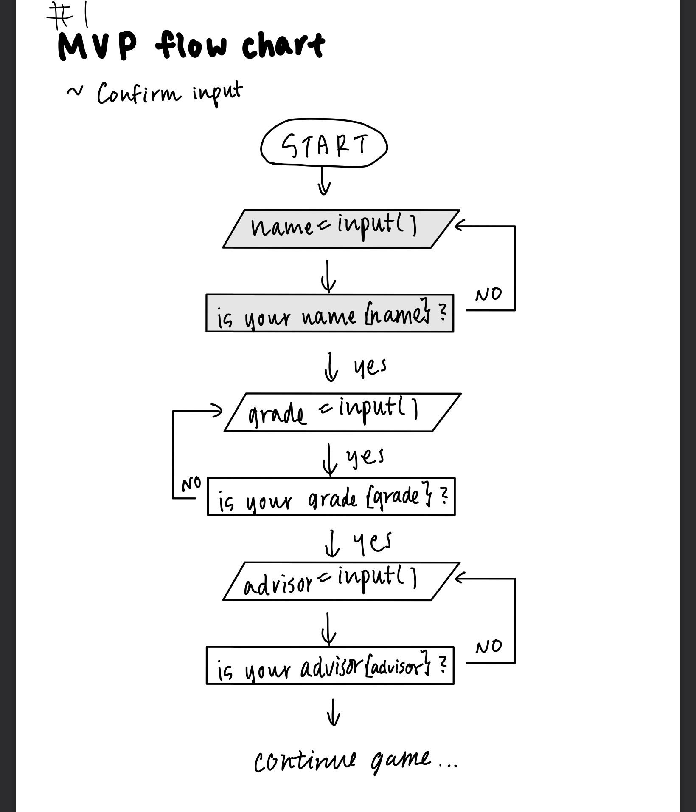
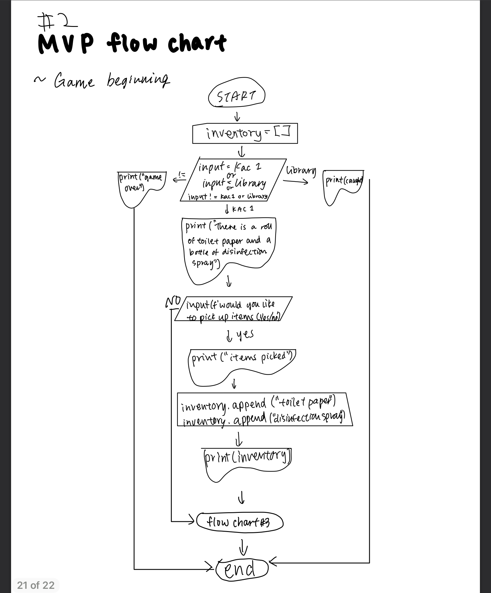
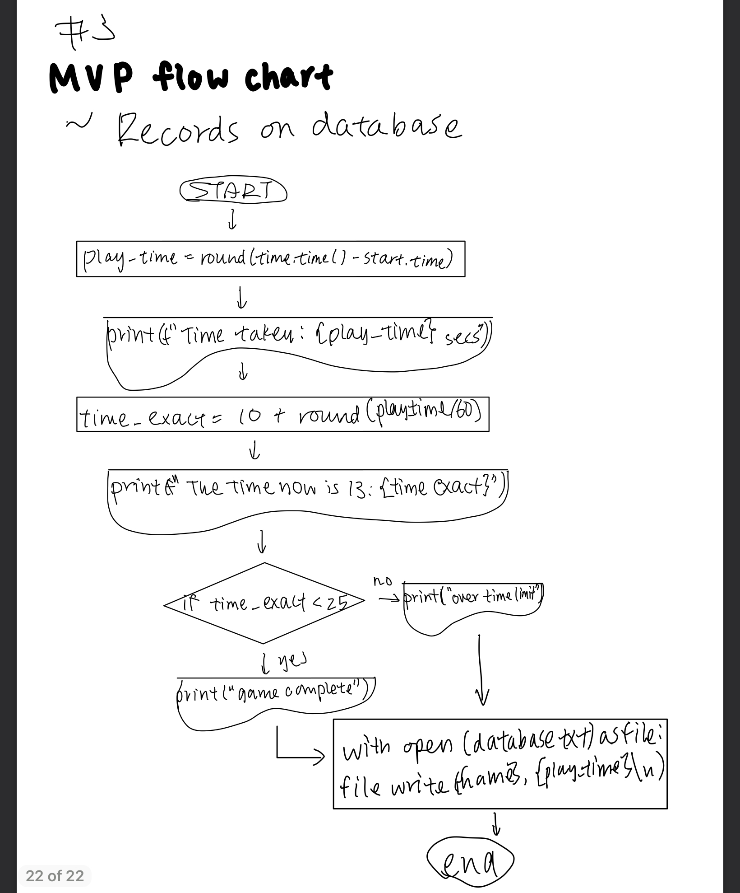

# Unit 1: A classic game 

# Criteria A: Planning

## Problem definition

The owner of the local game shop is an enthusiast of classic computer games. He has been looking for a talented programmer that can help him revive his passion for text-based games. He has few requirements for this task:

Apart for this requirements, the owner is open to any type of game, topic or genre.

## Proposed Solution

### Design statement
I will try to design and make a game for a client who is the owner of the local game shop. The game will be a escape game and is constructed using the software python 3.9. It will take 3 weeks to make and will be evaluated according to the criteria A and B.

This game is created using python because it is the only language I am familiar with thus it is one of the most commonly used programming language in the world.

## Success Criteria
1. The game has to be entirely text-based.
2. The game must record the time played.
3. The game must record the player name and score.
4. Display rankings; name of player and score
5. Checkpoint for saving the progress of the player
6. Add time limit of 30 mins

# Criteria B: Design

## System Diagram

Figure 1. system diagram for the game

The system will be based on Mac OS 10.15.6 with Dual-Core Intel Core i3. This game will be created on python 3.9, where input will be from keyboard and output generated as text on screen monitor. 

## Flow Diagrams

Flow chart 1:
This is the flow chart for the confirm input system, where, the users' name, grade and advisor are asked and confirmed to ensure accuracy in the input of information.

Flow chart 2:
This is the flow chart of the beginning of the game, where the player is asked two locational option to preceed into. Here, one option leads to an immediate game ending, and the other proceeds to picking up items and filling the inventory.

Flow chart 3:
This is the flow chart of the recording of the data, name and time taken for user to complete the game. Additionally, it determines whether the player has completed the game in time or not. The data is printed in an external file. 
***** the scenario of the game is set as stop and clean time, 13:10, and the program displays the time taken, as well as the time in reference to 13:10

## Record of Tasks
| Task No | Planned Action | Planned Outcome | Time estimate | Target completion date | Criterion |
|---------|----------------|-----------------|---------------|------------------------|-----------|
|    1     |       create system siagram         |       to have a clear idea of the hardware and software requirements for the proposed solution       |         20mins        |             Sep 24            |      B     |
|    2     |                |                 |               |                        |           |
|    3     |                |                 |               |                        |           |
|    4     |                |                 |               |                        |           |
|    5     |       unit test: function for encoding with the caesar sypher         |         to check that the function worls as expected. Test with input "nagisa" and key = 3. The outcome should be "qdjlvd"        |        30 mins       |            Oct 7            |      E     |
|    6     |                |                 |               |                        |           |
|    7     |                |                 |               |                        |           |
|    8     |                |                 |               |                        |           |
|    9     |                |                 |               |                        |           |
|    10     |                |                 |               |                        |           |
|    11    |                |                 |               |                        |           |
|    12    |                |                 |               |                        |           |
|    13     |                |                 |               |                        |           |

